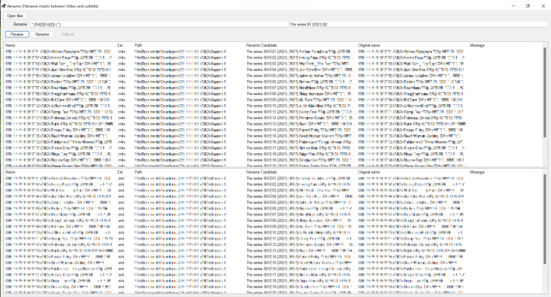

# File Rename

Rename: Filename match between Video and subtitle



## Pre-requirements

* .NET 5

## Environment

* Windows 10+ x64


## Build executable application

### WinForms app

```powershell
PS> dotnet publish --output out --configuration Release src/SubtitleFileRename
```

### WPF app

```powershell
PS> dotnet publish --output out --configuration Release src/SubtitleFileRename.v2.App
```